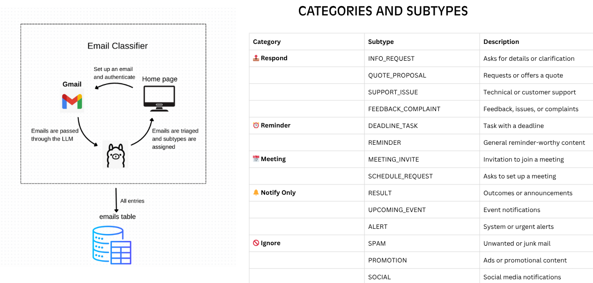
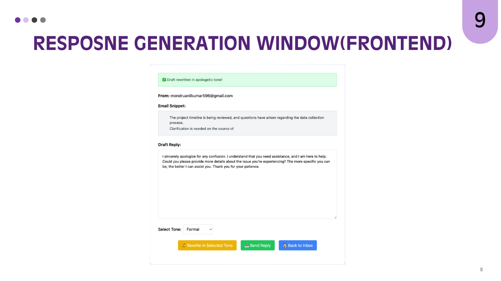

# Inbox Agent

An intelligent email management system that automatically classifies emails, generates AI-powered responses, schedules meetings, and creates reminders using LLaMA 3.1 and Google APIs.

## Features

### 🤖 AI-Powered Email Processing

- **Automatic classification** into 13+ categories (INFO_REQUEST, MEETING_INVITE, SUPPORT_ISSUE, etc.)
- **AI-generated draft responses** using Groq LLaMA 3.1
- **Tone adjustment** with 5 different styles (formal, casual, assertive, friendly, apologetic)
- **Smart content summarization** for quick email review


### 📅 Calendar Integration

- **Google Calendar sync** for seamless meeting scheduling
- **Auto-generated Google Meet links** for video conferences
- **Calendar reminder creation** with popup and email notifications
- **Meeting conflict detection** and availability checking


### 🎯 Smart Workflow Management

- **Deadline detection** and automatic reminder creation
- **Database persistence** (SQLite) for email history and analytics
- **Web dashboard** for unified email and calendar management
- **Responsive HTML interface** for all devices


## Technology Stack

| Component | Technology |
| :-- | :-- |
| **Backend** | Flask, Python 3.8+ |
| **AI/ML** | Groq API, LLaMA 3.1, Mixtral-8x7b |
| **Database** | SQLAlchemy, SQLite |
| **Email** | Gmail API, Google OAuth2 |
| **Calendar** | Google Calendar API |
| **Frontend** | HTML5, Bootstrap, Jinja2 |
| **Workflow** | LangGraph |

## Architecture Overview


### System Architecture


### Microservice Architecture



## Database Schemas


## Project Structure

```
📁 major/                           # Root project directory
├── 📁 .secrets/                    # Environment configuration
│   └── settings.json               # API keys & email settings
├── 📁 .venv/                       # Python virtual environment
├── 📁 core/                        # Core business logic modules
│   ├── __init__.py                 # Package initialization
│   ├── ai_responder.py            # LLaMA draft generation engine
│   ├── auth.py                    # Google OAuth2 authentication
│   ├── calendar_manager.py        # Google Calendar API integration
│   ├── config_loader.py           # YAML configuration loader
│   ├── data_models.py             # Pydantic data validation models
│   ├── database.py                # SQLAlchemy ORM & database operations
│   ├── email_classifier.py        # 13-category AI email classification
│   ├── email_rewriter.py          # AI-powered tone adjustment
│   ├── email_service.py           # Gmail API service layer
│   ├── helpers.py                 # Utility functions & HTML processing
│   ├── run_refresh_token.py       # OAuth token refresh utility
│   ├── token_gen.py               # Initial OAuth token generation
│   └── workflow_manager.py        # LangGraph workflow orchestration
├── 📁 data/                        # Application data storage
│   └── emails.db                  # SQLite database (auto-generated)
├── 📁 scripts/                     # Standalone utility scripts
│   ├── __init__.py                # Package initialization
│   ├── authenticate_email.py      # Email authentication setup
│   ├── schedule_jobs.py           # Background task scheduling
│   └── test_single_run.py         # Development testing script
├── 📁 tests/                       # Unit & integration tests
├── 📁 ui/                          # Flask web interface
│   ├── 📁 static/                  # Static assets (CSS, JS, images)
│   ├── 📁 templates/               # Jinja2 HTML templates
│   │   ├── dashboard.html          # Unified calendar/reminder dashboard
│   │   ├── email_actions.html      # Email action selection interface
│   │   ├── email_reminder.html     # Reminder creation & management
│   │   ├── email_respond.html      # AI reply composition interface
│   │   ├── email_schedule.html     # Meeting scheduling interface
│   │   ├── emails.html             # Email inbox & classification view
│   │   ├── index.html              # Main application homepage
│   │   ├── rewrite.html            # Tone adjustment interface
│   │   ├── send.html               # Manual email composition
│   │   └── settings.html           # Application configuration
│   ├── __init__.py                 # UI package initialization
│   └── app.py                      # Flask application & routing logic
└── requirements.txt                # Python dependencies
```


## Installation \& Setup

### Prerequisites

- Python 3.8+
- Google Cloud Project with Gmail \& Calendar APIs enabled
- Groq API key for AI processing


### Environment Setup

```bash
# 1. Clone the repository
git clone https://github.com/Anil970198/major.git
cd major

# 2. Create virtual environment
python -m venv .venv
source .venv/bin/activate  # On Windows: .venv\Scripts\activate

# 3. Install dependencies
pip install -r requirements.txt

# 4. Create configuration directory
mkdir .secrets
```


### API Configuration

1. **Google APIs Setup**:
    - Create a Google Cloud Project
    - Enable Gmail API and Google Calendar API
    - Create OAuth2 credentials
    - Download credentials.json to `.secrets/`
2. **Groq API Setup**:
    - Sign up at [Groq Console](https://console.groq.com)
    - Generate API key
    - Add to settings.json
3. **Create `.secrets/settings.json`**:
```json
{
  "monitored_email": "your-email@example.com",
  "timezone": "Asia/Kolkata",
  "groq_api_key": "your-groq-api-key"
}
```


### Database Initialization

```bash
# Run the Flask app to auto-create database tables
python ui.app
```


## Usage \& Screenshots

### Main Dashboard

The central hub for monitoring email processing status and quick navigation.


### Email Classification

Automatically categorized emails with AI-powered classification into 13 different types.


### AI Response Generation & Tone Rewriting Interface

Generate intelligent draft responses with tone adjustment capabilities. Adjust email tone with 5 different styles for professional communication.


### Meeting Scheduling & Reminder Management

Seamless Google Calendar integration with automatic Meet link generation.
Smart deadline detection and reminder creation with calendar integration.


### Settings Configuration

Easy setup of monitored email addresses and system preferences.

### Unified Dashboard

Complete overview of meetings, reminders, and scheduled activities.


## Core Components

### Email Classification System

The system uses **Mixtral-8x7b** model to classify emails into 13 categories:

- **EMAIL** (requires response): INFO_REQUEST, QUOTE_PROPOSAL, SUPPORT_ISSUE, FEEDBACK_COMPLAINT, MEETING_INVITE, SCHEDULE_REQUEST, DEADLINE_TASK
- **NOTIFY** (informational): RESULT, UPCOMING_EVENT, ALERT
- **NO** (can ignore): SPAM, PROMOTION, SOCIAL


### AI Response Engine

Powered by **LLaMA 3.1-8b-instant**, the response generator:

- Analyzes email context and intent
- Generates contextually appropriate replies
- Maintains professional tone and structure
- Supports custom tone adjustments


### Calendar Manager

Google Calendar integration provides:

- Meeting scheduling with conflict detection
- Automatic Google Meet link generation
- Reminder creation with multiple notification methods
- Availability checking across date ranges


## API Reference

| Endpoint | Method | Purpose |
| :-- | :-- | :-- |
| `/` | GET | Main dashboard |
| `/emails` | GET | Display classified emails |
| `/fetch` | POST | Fetch new emails from Gmail |
| `/email/<id>/respond` | GET | Email response interface |
| `/email/<id>/schedule` | GET | Meeting scheduling interface |
| `/email/<id>/generate_draft` | POST | Generate AI draft response |
| `/email/<id>/rewrite` | POST | Rewrite draft with tone |
| `/email/<id>/send` | POST | Send email reply |
| `/email/<id>/schedule_meeting` | POST | Create calendar meeting |
| `/reminder/<id>` | GET/POST | Reminder management |
| `/dashboard` | GET | Unified calendar/reminder view |
| `/settings` | GET/POST | Configuration management |

## Configuration

### Database Schema

The system uses 4 main tables:

- **Email**: Stores email metadata and AI classifications
- **Reminder**: Deadline tracking and calendar reminders
- **Meeting**: Scheduled meetings with Google Calendar links
- **SentEmail**: Log of outgoing email responses


### Environment Variables

```bash
GROQ_API_KEY=your-groq-api-key
GOOGLE_APPLICATION_CREDENTIALS=path/to/credentials.json
```


## Development

### Running the Application

```bash
# Start Flask development server
cd ui
python app.py

# Access at http://localhost:5000
```


### Testing Email Processing

```bash
# Run single email processing test
python scripts/test_single_run.py

# Authenticate Gmail access
python scripts/authenticate_email.py
```


## Contributing

1. Fork the repository
2. Create feature branch (`git checkout -b feature/amazing-feature`)
3. Commit changes (`git commit -m 'Add amazing feature'`)
4. Push to branch (`git push origin feature/amazing-feature`)
5. Open Pull Request

## Troubleshooting

### Common Issues

**Gmail API Authentication**:

- Ensure OAuth2 credentials are properly configured
- Check that Gmail API is enabled in Google Cloud Console
- Verify credentials.json is in `.secrets/` directory

**Groq API Rate Limiting**:

- Monitor API usage in Groq Console
- Implement exponential backoff for failed requests
- Consider upgrading to higher tier for production use

**Calendar Permission Issues**:

- Confirm Google Calendar API is enabled
- Verify OAuth scope includes calendar permissions
- Re-authenticate if calendar access fails

**Database Connection**:

- Ensure write permissions to `data/` directory
- Check SQLite database file isn't locked by another process
- Restart Flask app if database schema changes


## License

This project is licensed under the MIT License - see the [LICENSE](LICENSE) file for details.

## Acknowledgments

- **Groq** for providing fast AI inference
- **Google APIs** for Gmail and Calendar integration
- **LangGraph** for workflow orchestration
- **Flask** for the web framework

